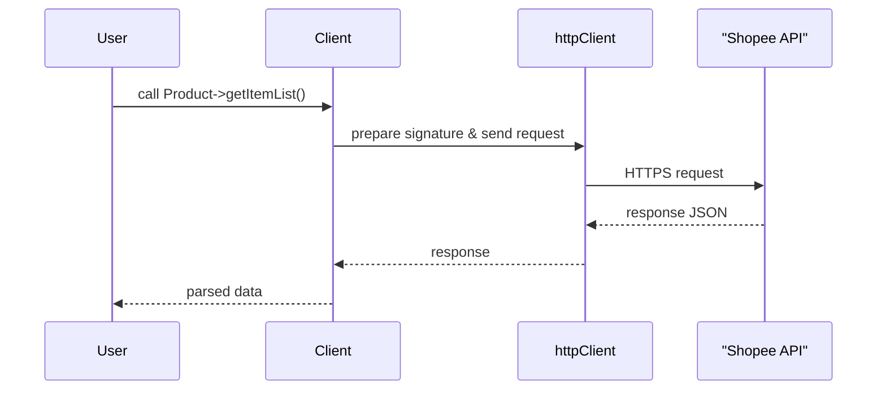
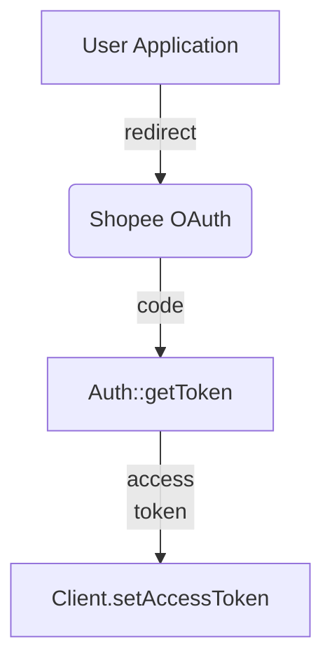

# Shopee PHP SDK Overview

This project provides a PHP client for the Shopee API. The main components are:

- `Client` – handles authentication and request signing
- `Resource` – base class for all endpoint wrappers
- `Resources/*` – specific API resources (Product, Order, Logistic...)

The flow below shows how a request travels through the SDK.


```

Authentication uses a separate `Auth` helper. Shops authorize your application via OAuth and you receive an access token.


```

The original SDK is written in PHP but a TypeScript version is being added in `ts-src` for use in Node.js projects.

Additional TypeScript resources are gradually being ported. For example, the `Logistic` class mirrors the PHP version and supports shipping document generation as shown below.


All resource classes from the PHP SDK are now available in TypeScript. You can access them via `import * as Resources from './dist/resources'` after building.

## TypeScript Resource Methods

Each TypeScript resource mirrors its PHP counterpart. Below is a comprehensive list of the available methods.

- **AccountHealth**
  - `getShopPerformance`
  - `shopPenalty`
  - `getMetricSourceDetail`
  - `getPenaltyPointHistory`
  - `getPunishmentHistory`
  - `getListingsWithIssues`
  - `getLateOrders`
- **AddOnDeal**
  - `addAddOnDeal`
  - `addAddOnDealMainItem`
  - `addAddOnDealSubItem`
  - `deleteAddOnDeal`
  - `deleteAddOnDealMainItem`
  - `deleteAddOnDealSubItem`
  - `getAddOnDealList`
  - `getAddOnDeal`
  - `getAddOnDealMainItem`
  - `getAddOnDealSubItem`
  - `updateAddOnDeal`
  - `updateAddOnDealMainItem`
  - `updateAddOnDealSubItem`
  - `endAddOnDeal`
- **Ads**
  - `getTotalBalance`
  - `getShopToggleInfo`
  - `getRecommendedKeywordList`
  - `getRecommendedItemList`
  - `getAllCpcAdsHourlyPerformance`
  - `getAllCpcAdsDailyPerformance`
- **Authorization**
  - `getShopsByPartner`
  - `getMerchantsByPartner`
  - `getToken`
  - `refreshNewToken`
  - `getTokenByResendCode`
  - `getRefreshTokenByUpgradeCode`
  - `getShopeeIpRanges`
- **BundleDeal**
  - `addBundleDeal`
  - `updateBundleDeal`
  - `endBundleDeal`
  - `getBundleDealList`
  - `getBundleDeal`
  - `getBundleDealItem`
  - `updateBundleDealItem`
- **Chat**
  - `getMessage`
  - `sendMessage`
  - `getConversationList`
  - `getOneConversation`
  - `deleteConversation`
  - `getUnreadConversationCount`
  - `pinConversation`
  - `unpinConversation`
  - `readConversation`
  - `unreadConversation`
  - `uploadImage`
  - `sendAutoreplyMessage`
  - `muteConversation`
  - `deleteMessage`
- **Discount**
  - `addDiscount`
  - `addDiscountItem`
  - `deleteDiscount`
  - `deleteDiscountItem`
  - `getDiscount`
  - `getDiscountList`
  - `updateDiscount`
  - `updateDiscountItem`
- **FirstMile**
  - `getShippingDocumentInfo`
  - `downloadShippingDocument`
- **FollowPrize**
  - `getPrizeList`
  - `getPrizeItem`
  - `createPrize`
  - `updatePrize`
  - `deletePrize`
- **Logistic**
  - `getShippingParameter`
  - `getTrackingNumber`
  - `shipOrder`
  - `updateShippingOrder`
  - `getShippingDocumentParameter`
  - `createShippingDocument`
  - `getShippingDocumentResult`
  - `downloadShippingDocument`
  - `getTrackingInfo`
  - `getAddressList`
  - `setAddressConfig`
  - `deleteAddress`
  - `getChannelList`
  - `updateChannel`
  - `batchShipOrder`
  - `getShippingDocumentDataInfo`
- **MediaSpace**
  - `uploadImage`
  - `getImageList`
- **Merchant**
  - `getMerchant`
  - `getMerchantAuthSites`
  - `getMerchantShopList`
- **Order**
  - `getOrderList`
  - `getOrderDetail`
  - `setNote`
  - `cancelOrder`
  - `handleBuyerCancellation`
  - `splitOrder`
  - `unsplitOrder`
  - `getEscrowList`
  - `massGetEscrowDetails`
  - `setInvoiceData`
- **Payment**
  - `getEscrowDetail`
  - `setShopInstallmentStatus`
  - `getShopInstallmentStatus`
  - `getPayoutDetail`
  - `setItemInstallmentStatus`
  - `getItemInstallmentStatus`
  - `getPaymentMethodList`
  - `getWalletTransactionList`
  - `getEscrowList`
  - `getPayoutInfo`
  - `getBillingTransactionInfo`
- **Product**
  - `getItemList`
- **Push**
  - `publicKey`
  - `getWebhookInfo`
  - `setWebhookInfo`
- **Returns**
  - `getReturnList`
  - `getReturnDetail`
  - `confirm`
  - `dispute`
  - `getEscalationList`
- **Shop**
  - `getShopInfo`
  - `performance`
  - `getProfile`
  - `updateProfile`
- **ShopCategory**
  - `addShopCategory`
  - `deleteShopCategory`
  - `getShopCategoryList`
  - `updateShopCategory`
  - `addItemList`
  - `deleteItemList`
- **ShopFlashSale**
  - `addShopFlashSale`
  - `deleteShopFlashSale`
  - `getShopFlashSale`
  - `getShopFlashSaleList`
  - `updateShopFlashSale`
  - `addItem`
  - `deleteItem`
- **TopPicks**
  - `addTopPicks`
  - `deleteTopPicks`
  - `updateTopPicks`
  - `getTopPicksList`
  - `endTopPicks`
- **Voucher**
  - `addVoucher`
  - `deleteVoucher`
  - `updateVoucher`
  - `getVoucher`
  - `getVoucherList`
